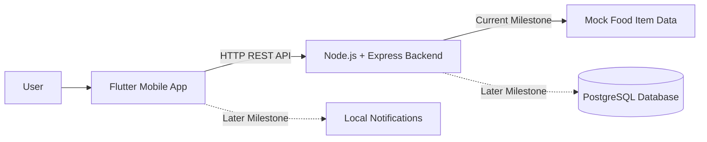

# ExpiryWise System Architecture

## Current Architecture

ExpiryWise is being built as a full-stack mobile application.

The current system has:

- A Flutter mobile app for the user interface
- A Node.js and Express backend for API routes
- Mock food item data for early backend testing
- PostgreSQL planned for a later milestone

## Explanation

The Flutter mobile app will be used by the user to manage grocery items and expiry dates.

The Express backend will provide API endpoints such as:

- `/api/health`
- `/api/food-items`

For now, the backend returns mock food item data. Later, the backend will connect to PostgreSQL to store real user data.